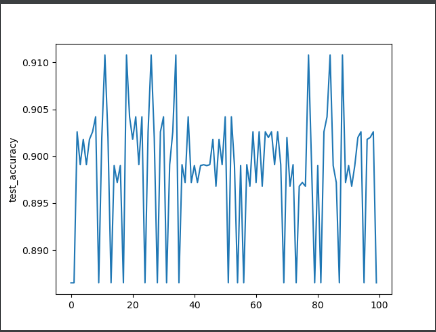

### 环境

- python3.8 （一开始是3.6，但是后来到差分隐私发现opacus必须用py3.7以上，于是直接换了环境）
- pytorch 1.10.2
- CPU：AMD Ryzen 5 4600H with Radeon Graphics            3.00 GHz
- 编辑器使用pycharm

### 一些说明

（缝缝补补堆出的代码。）

添加了差分隐私的部分，但是是直接利用的opacus库。

为了还原论文中的图像，我采取的参数都是论文中提到的数据（如 600个clients E=1 B = 10 C = 0.1），但是学习速率直接取了0.1，因为本地训练时间有点久+风扇起飞，不太好优化；同样因为时间原因所以通讯次数也只取了100。

non-IID的training_loss（好像什么都看不出来，很快就稳定在了1.2）:

non-IID的accuracy，有点怪：

### 参考内容

（有关读取mnist数据集的部分都是直接照搬的，一个是完全不会处理，另一个因为不会所以上网搜发现有写好了的，\*二次加工\*总是报各种错，所以就直接搬过来了。）

https://github.com/zergtant/pytorch-handbook
https://blog.csdn.net/qq_36018871/article/details/121361027
https://blog.csdn.net/xbn20000224/article/details/120660384
https://zhuanlan.zhihu.com/p/359060612
https://github.com/pytorch/opacus
https://blog.csdn.net/qq_36965067/article/details/123604987
https://stackoverflow.com/questions/66994662/pytorch-warning-about-using-a-non-full-backward-hook-when-the-forward-contains-m

### 实验记录

#### 未添加差分隐私

（这张图有一些问题，其中accuracy是越接近0越好。）